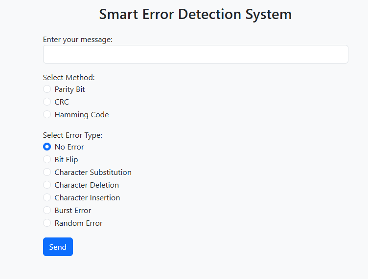
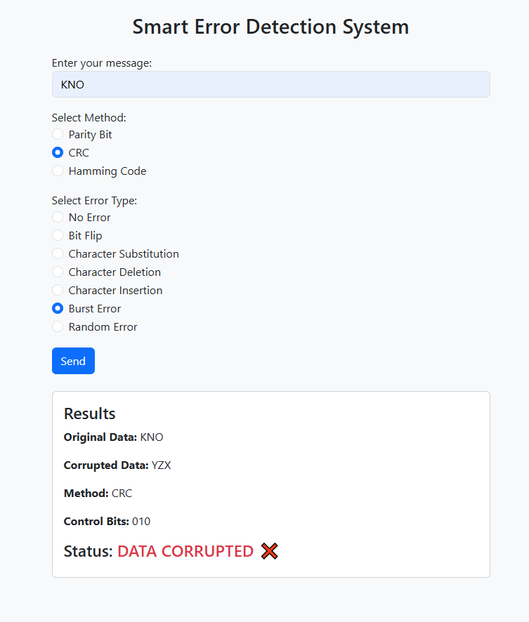

# Smart Error Detection System – Web Interface

A modern web-based implementation of data communication error detection and correction techniques.  
This project demonstrates **Parity Bit**, **CRC**, and **Hamming Code** with multiple error injection methods — all through a clean and simple web UI .

---

## 🖼️ System Preview

### **Home Page**s

### **Results Section Example**

---

## 📌 Project Structure

project_folder/
│── app.py # Main Flask web application
│── utils.py # Error detection & correction algorithms
│── templates/
│ └── index.html # Front-end (Bootstrap UI)
│── README.md # This guide

---

## 🔧 Requirements

Before running the project, install the required packages.

### Install Flask:

Or using Python Launcher:

---

## ▶️ How to Run the Project

Follow these steps:

### 1️⃣ Open the folder in VS Code (or any editor)

### 2️⃣ Ensure files exist:

- `app.py`
- `utils.py`
- `templates/index.html`

### 3️⃣ Open terminal **inside the project folder**

### 4️⃣ Run the Flask app:

Or:

### 5️⃣ Open your browser at:

👉 **http://127.0.0.1:5000**

Now the web interface is ready.

---

## 🖥️ Using the Web Interface

The page includes:

### **Enter your Message**

Type any text to test:

### **Select Error Detection Method**

- Parity Bit
- CRC
- Hamming Code

### **Select Error Type**

Choose one:

- No Error
- Bit Flip
- Character Substitution
- Character Deletion
- Character Insertion
- Burst Error
- Random Error (system picks randomly)

### **Click Send**

The system automatically:

- Generates control bits
- Applies the selected error
- Recomputes or corrects the message
- Displays full results
